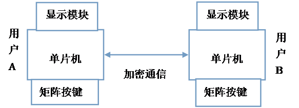

**A类程序使用python编写，运行代码时要用pip安装对应包
pip install tkinter, pandas
也可直接使用文件夹内编译好的exe运行**

以下为课程要求：

**A类课题：**

**A1**、**打字程序（10分）**

**课题内容：**

设计一个打字程序。包括随机产生字符串，以及字符串比较和统计。通过此课题，熟练掌握数组、格式输出、字符串处理等。

**课题要求：**

（1）随机产生一字符串，每次产生的字符串内容、长度都不同；

（2）根据（1）的结果，输入字符串，判断输入是否正确，输出正确率；

（3）具有输入输出界面。

 

**A2、文本编辑器（10分）**

**课题内容：**

设计一个简单的文本编辑器，该系统要求对一个文本文件中的内容进行各种常规操作，如：插入、删除、查找、替换等功能。通过此课题，熟练掌握文本文件的操作及用字符数组或字符指针实现字符串操作的功能。 

插入： 字符、位置。

**课题要求：**

（1）编辑文本；

（2）保存、打开指定位置的文本文件；

（3）具有输入输出界面。

 

**A3、学生成绩核算系统的设计与实现（30分）**

**课题内容：**

设计一个学生成绩核算系统。能实现从文件中读取学生成绩资料，并提供成绩查询统计服务。通过此课题，熟练掌握文件、数组、结构体的各种操作以及友好界面的设计。

**课题要求：**

（1）按班级按课程从文件中读入相应的平时成绩、期中考试成绩和期末考试成绩。

（2）三个成绩对总评成绩的百分比被定义为常数，各占总成绩的30%、30%和40%。

（3）计算每位学生的总评成绩。

（4）计算该班级本课程的总平均成绩。

（5）计算处于优、良、中、及格、不及格的学生人数以及占总人数的百分比。其中100-90为优，89-80为良，79-70为中，69-60为及格，60分以下为不及格。

（6）按要求输出成绩在优、良、中、及格、不及格各区间的学生学号、成绩。

**B类课题（嵌入式）：**

**B1、科学计算器（25分）**

**课题内容：**

基于嵌入式开发流程，设计一个科学计算器。能够完成基本的加减乘除运算，并能对显示结果进行进制转换（二、八、十、十六进制数互相转换），系统基本框图如下。通过此课题，熟练掌握字符串、格式输出、进制换算等各种操作。

**课题要求：**

（1）   可输入数据和运算符。

（2）   依据按键输入运算信息，将运算公式及结果（默认十进制）显示。

（3）   通过按键 按要求进制对运算结果进行显示（二、八、十、十六进制）。

 

**B2、加密通信（25分）**

**课题内容：**

构建一套嵌入式加密通信系统，完成用户双方的保密通信，系统组成框图如下。信息发送方完成对信息的加密（明文+密钥的转换）；接收方接收加密信息后，依据正确密钥解密信息，并将信息显示。通过此课题，熟练掌握数组、格式输出、字符串处理、类型转换等。

)

**课题要求：**

（1）   信息收发双方，通过按键输入加密秘钥K。

（2）   信息发送方，通过按键输入任意一段明文M，并在显示模块中显示；

（3）信息发送方，根据以下公式将信息加密为密文C，通过串口发送出去。

   Ci = mi + K ,其中i = 0,1,……n-1 , K 为密钥；

（4）信息接收方，通过串口接收密文，并将解密信息进行显示。

